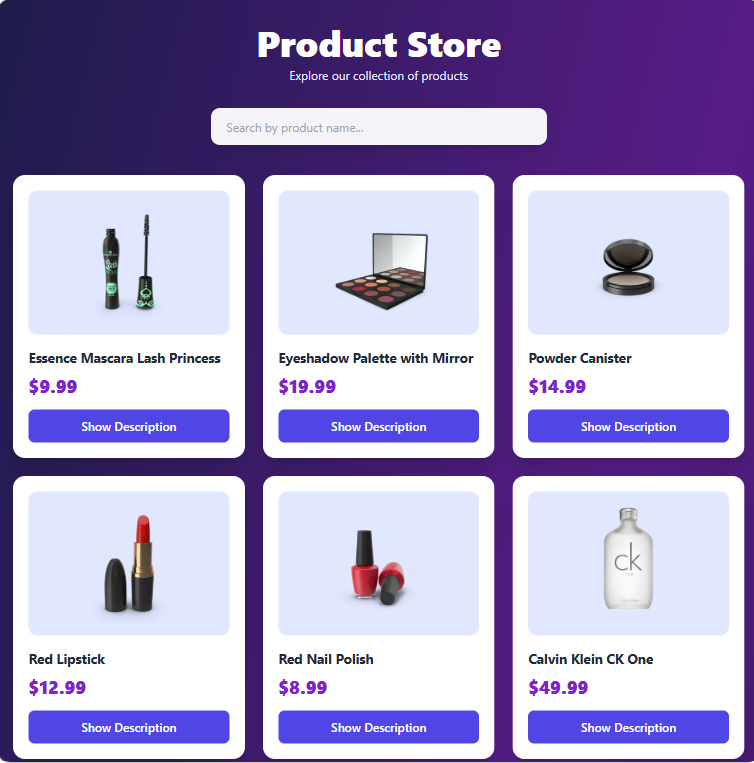

# 🛍️ Product Explorer

A responsive product browsing application built with React.js, Tailwind CSS, and custom React Hooks.

The app fetches products from an external API, allows users to search products by name, and lets users individually show or hide product descriptions.

## 🚀 Live Demo


## 📸 Preview



## 📸 Features

- Fetches product data from an external API
- Displays products in a responsive grid layout
- Search products by name
- Individual product description show/hide
- Loading state
- Error state
- Responsive design for mobile, tablet, and desktop
- Reusable custom React Hooks

## 🛠️ Technologies Used

- React.js
- JavaScript (ES6+)
- Tailwind CSS
- React Hooks
- Custom Hooks
- DummyJSON API

## 🧩 Custom Hooks Used

"useFetch"

Used to handle API data fetching, loading state, and error state.

const { data, isError, isLoading } = useFetch(
  "https://dummyjson.com/products"
)

"useForm"

Used to manage the search input value.

const { values, handleChange } = useForm({
  search: ""
})

The search value is then used to filter products:

const filteredProducts = data.products.filter(product =>
  product.title
    .toLowerCase()
    .includes(values.search.toLowerCase())
)

"useToggle"

Used inside each "Product" component to independently show or hide its description.

const [isOpen, handleToggle] = useToggle()

This allows every product to maintain its own description state.

## 🔄 How It Works
```
DummyJSON API
      ↓
    useFetch
      ↓
  ProductList
      ↓
  Search Input
      ↓
    useForm
      ↓
 filteredProducts
      ↓
    Product
      ↓
   useToggle
      ↓
Show / Hide Description
```
📁 Project Structure
```
src/
├── components/
│   ├── Product.jsx
│   └── ProductList.jsx
│
├── hooks/
│   ├── useFetch.js
│   ├── useForm.js
│   └── useToggle.js
│
├── App.jsx
└── main.jsx
```
## ⚙️ Installation

Clone the repository:

git clone YOUR_GITHUB_REPOSITORY_URL

Navigate into the project:

cd product-explorer-react

Install dependencies:

npm install

Start the development server:

npm run dev

## 🎯 What I Practiced

This project helped me practice:

- Creating and using custom React Hooks
- Managing form/input state
- Fetching API data
- Handling loading and error states
- Filtering arrays with "filter()"
- Rendering lists with "map()"
- Component-level state
- Passing data through props
- Conditional rendering
- Responsive UI with Tailwind CSS

## 🔮 Future Improvements

- Add product categories and category filtering
- Add a product details page using React Router
- Add sorting by price
- Add pagination
- Add a shopping cart
- Improve accessibility
- Add skeleton loading UI

### 👩🏻‍💻 Author

Alishba Shahid

Frontend Web Developer | React.js | Tailwind CSS

GitHub: https://github.com/alishbatech
